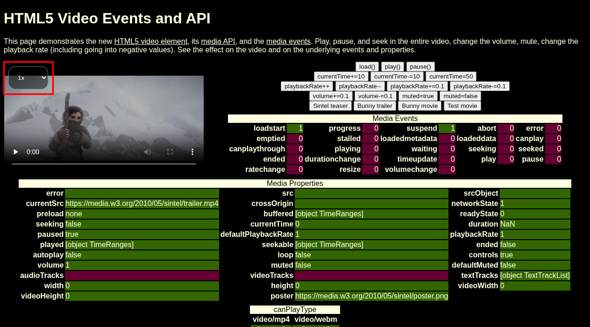
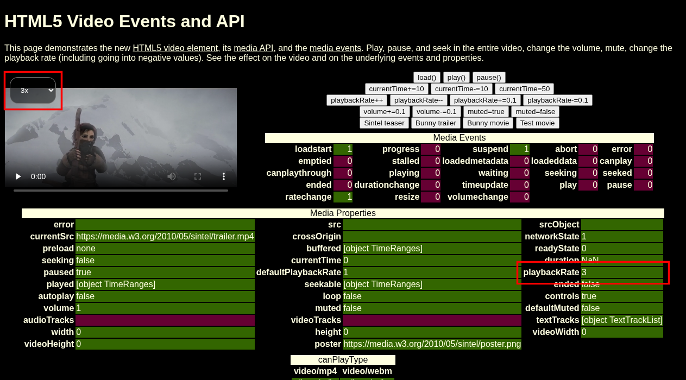

# Faster

A simple Firefox extension to control HTML video elements playback rate.

Faster adds a speed selector overlay to every HTML5 video element on any webpage, letting you adjust playback speed from 1x to 3x.

## Features

- Adds a playback speed selector (1x to 3x) to all HTML5 video elements
- Detects videos in Shadow DOM
- Automatically tracks dynamically added and removed videos
- Minimal, non-intrusive UI that fades when not hovered

## Screenshots

Screenshots taken from [W3C Video Events and API](https://www.w3.org/2010/05/video/mediaevents.html).





## Install

[Firefox Add-ons](https://addons.mozilla.org/en-US/firefox/addon/zphrio-faster/)

## Build

```bash
npm install
npm run build
```

## License

[MIT](LICENSE)
